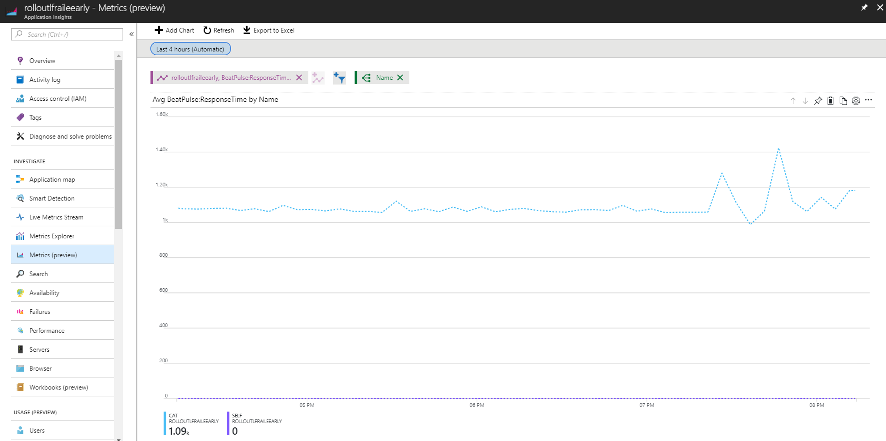
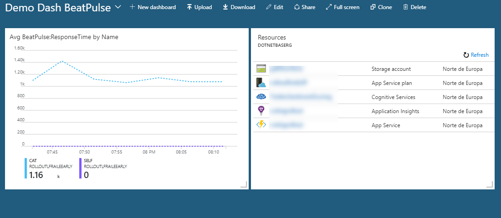
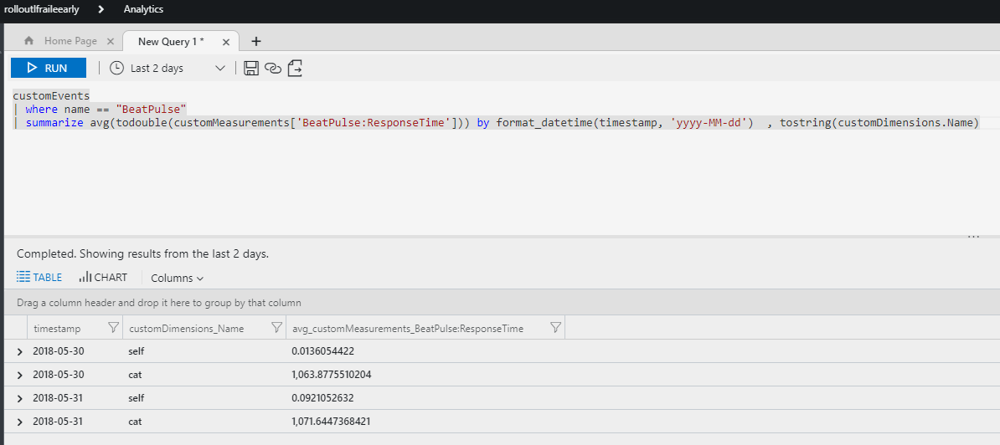

# Application Insights tracker

The Application Insights tracker, allows to track the response information from the *liveness pulses* as [custom events](https://docs.microsoft.com/en-us/azure/application-insights/app-insights-api-custom-events-metrics) in Application Insights with this information:


Part of the info we store in Application Insights is the response time in milliseconds for each of the *pulses* tracked as a metric for the event, with this information, and the new [*Metrics (preview)*](https://docs.microsoft.com/en-us/azure/monitoring-and-diagnostics/monitoring-metric-charts) blade in Azure Portal, you can create your own charts to track slow response from pulses over time, just create a new metric from the pulse information, with the average time, split by the name of the pulse, which is also part of the information stored in the custom event:



This charts can be pinned on your [*Azure Dashboards*](https://docs.microsoft.com/en-us/azure/monitoring-and-diagnostics/monitoring-metric-charts#how-do-i-pin-charts-to-dashboards) also.



One last way to explode this information is via [Application Insights Analytics](https://docs.microsoft.com/en-us/azure/application-insights/app-insights-analytics), which allows to query information on application Insights and create graphics based on this analytics queries, like this one which shows average response time for each pulse per day, in the last two days.

``` Azure Analytics
customEvents
| where name == "BeatPulse"
| summarize avg(todouble(customMeasurements['BeatPulse:ResponseTime'])) by format_datetime(timestamp, 'yyyy-MM-dd')  , tostring(customDimensions.Name)
```



## Installation

``` Powershell
Install-Package BeatPulse.ApplicationInsightsTracker
```

### Application Insights tracker configuration

In the configuration section where you configured your *BetPulseService* add the tracker,

```csharp
    public class Startup
    {       
        public void ConfigureServices(IServiceCollection services)
        {
            services.AddBeatPulse(setup =>
            {
                setup.AddApplicationInsightsTracker();
            });
        }
    }

